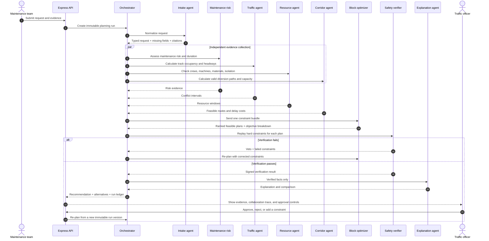

# AI Agent Integration Plan

## Implementation status — 2026-09-12

The first safe vertical slice is implemented:

- v2 response contracts and input validation;
- real per-agent execution traces with evidence, timing, artifacts, and implementation versions;
- timetable-backed candidate-window search, including overnight and next-day handling;
- an independent safety verifier with hard veto authority;
- fail-closed behavior in Python, Express, batch planning, and the browser;
- server-side prevention of approvals for unverified plans;
- persisted agent runs, steps, and constraint results, plus a retrieval endpoint;
- an officer-facing trace, evidence drawer, warnings, and hard-constraint matrix;
- an optional OpenRouter-backed DeepSeek Explanation Agent with structured output, verified-facts-only grounding, and a labeled deterministic fallback;
- a visual explanation panel comparing requested and recommended windows, reasons, avoided risks, and officer checks;
- automated conflict, blackout, overnight, degraded-data, veto, and contract tests.

Phases 1-3 below remain the roadmap for resource-aware CP-SAT optimization, grounded language-model intake/explanation, live operational feeds, and portfolio learning. Those require authoritative resource/data integrations and model-provider configuration; they are intentionally not simulated.

## 1. Objective and success measures

The goal is not to add more chatbots. It is to make railway block planning faster, safer, easier to audit, and easier for an officer to understand.

The first production target should be:

- reduce median request-to-recommendation time by at least 60%;
- detect 100% of conflicts present in the timetable and constraint test set;
- produce no recommendation that violates a hard safety, blackout, or track-occupancy constraint;
- attach source evidence and a complete agent trace to every score and recommendation;
- require a named traffic officer to approve every operational plan;
- keep p95 planning latency below 10 seconds for a single request and below 2 minutes for a weekly batch.

## 2. What exists today

The repository already has a useful prototype pipeline:

1. `MaintenanceAgent` normalizes request fields and creates condition scores.
2. `TrafficAgent` fetches schedules, detects overlaps, and checks a small routing graph.
3. `BlockPlannerAgent` calculates an MCDA score and returns three alternatives.
4. `OrchestratorAgent` calls those components in sequence.
5. `AgentDecisionTrace.jsx` presents a five-step decision ledger to the officer.

This is a good demonstration, but it is not yet a trustworthy collaborative AI system:

- most missing values are generated from the digits in a track ID rather than operational evidence;
- the routing graph and several alternative windows are hard-coded;
- the agents exchange ordinary dictionaries without a versioned contract or provenance;
- a prohibited-window revision assumes the time immediately afterward is clear without re-running traffic checks;
- only one track is analyzed when a request contains multiple track IDs;
- no independent agent verifies the final recommendation;
- no run ID, per-agent status, evidence source, model/rule version, confidence, or timing is persisted;
- the JavaScript fallback returns different logic from the Python service, so identical inputs may produce different plans;
- the current UI trace is reconstructed from the final response; it does not show the actual execution trace.

## 3. First-principles architecture

Safety constraints, timetable overlap, route availability, resource capacity, and interval arithmetic are deterministic problems. A language model must not be the authority for them. AI is valuable where the input is unstructured or an explanation must be created from verified facts.

Use a hybrid architecture:

| Component | Responsibility | Implementation | May block a plan? |
| --- | --- | --- | --- |
| Intake agent | Convert notes, forms, inspection reports, and fault descriptions into a typed maintenance request | LLM with schema-constrained output, plus field validators | Yes, when required inputs are missing |
| Maintenance risk agent | Calculate urgency, criticality, failure risk, duration range, and work dependencies from evidence | Rules/model over asset history and sensor data | Yes, for critical asset conditions |
| Traffic agent | Build occupancy intervals from timetables, live running data, possessions, and temporary restrictions | Deterministic interval engine | Yes |
| Resource agent | Check crew, machine, material, isolation, and access availability | Deterministic database queries and rules | Yes |
| Corridor agent | Find valid bypasses and calculate route capacity and delay | Network graph and routing algorithm | Yes |
| Block optimizer | Jointly schedule requests under hard constraints and minimize operational cost | Constraint solver such as OR-Tools CP-SAT | Yes |
| Safety verifier | Independently replay every hard constraint against the proposed plan | Separate deterministic ruleset | Yes; this agent has veto authority |
| Explanation agent | Turn the verified evidence and solver result into an officer-readable summary | LLM, grounded only in the run ledger | No |
| Orchestrator | Manage the state machine, parallel work, retries, timeouts, and human approval | Durable workflow code | No; it routes outcomes |

The planner should optimize an auditable objective instead of inventing a generic score:

`cost = safety_risk + passenger_delay + freight_delay + cancellation_risk + crew_idle_time + equipment_move_cost + maintenance_lateness`

Hard constraints are never traded away for a lower cost. They include occupied track, officer blackout windows, required isolation, minimum headway, resource double-booking, incompatible simultaneous works, and maximum work duration.

## 4. How the agents collaborate



Agents do not chat freely. They publish typed artifacts to the run ledger. The orchestrator decides what runs next, and every downstream agent declares which artifact versions it consumed. This prevents hidden context, makes retries idempotent, and gives the UI a real collaboration history.

### Planning run state machine

`RECEIVED -> NORMALIZING -> GATHERING_EVIDENCE -> OPTIMIZING -> VERIFYING -> AWAITING_OFFICER -> APPROVED | REJECTED | NEEDS_INPUT`

If the verifier rejects a candidate, the run returns to `OPTIMIZING`. Limit this loop to two retries; after that, return `NEEDS_INPUT` with the exact unsatisfied constraints.

## 5. Shared contract and evidence ledger

Every request to `/agent/plan` should create a `runId`. The response should preserve the current fields for frontend compatibility and add the following structure:

```json
{
  "schemaVersion": "2.0",
  "runId": "run_01J...",
  "requestId": "ENG-2026-00008",
  "status": "AWAITING_OFFICER",
  "recommendation": {},
  "alternatives": [],
  "verification": {
    "passed": true,
    "checkedRules": ["NO_TRACK_OCCUPANCY_OVERLAP", "MINIMUM_HEADWAY"],
    "failedRules": []
  },
  "trace": [
    {
      "stepId": "traffic-1",
      "agent": "traffic",
      "status": "SUCCEEDED",
      "startedAt": "2026-09-12T10:00:00Z",
      "finishedAt": "2026-09-12T10:00:00.180Z",
      "inputArtifactIds": ["normalized-request:v1"],
      "outputArtifactIds": ["track-occupancy:v1"],
      "evidence": [
        {
          "sourceType": "TIMETABLE",
          "sourceId": "schedule:KA-T-000342:2026-09-15",
          "observedAt": "2026-09-12T09:59:58Z"
        }
      ],
      "summary": "Two conflicting movements found",
      "implementationVersion": "traffic-rules@2.1.0"
    }
  ],
  "warnings": [],
  "requiresHumanApproval": true
}
```

Store large evidence payloads separately and reference them by ID and checksum. Do not store chain-of-thought. Store inputs, outputs, rule results, evidence citations, concise summaries, versions, confidence/calibration values where meaningful, and officer actions.

Recommended new tables:

- `agent_runs`: request, state, version, timestamps, initiator, final outcome;
- `agent_steps`: agent name, status, timing, implementation version, error, retry count;
- `agent_artifacts`: artifact type, schema version, JSON payload, checksum, provenance;
- `constraint_results`: rule ID, severity, pass/fail, evidence references;
- `human_decisions`: officer, selected alternative, reason, added constraints, timestamp;
- `agent_feedback`: actual outcome, delay, overrun, incident, officer override reason.

## 6. Officer experience: show real collaboration

Upgrade `AgentDecisionTrace.jsx` from five inferred cards to a live trace rendered from `agentPlan.trace`.

The officer should see:

1. A live status rail while a run is active: queued, running, passed, warning, failed, vetoed.
2. Parallel branches for maintenance, traffic, resource, and corridor analysis.
3. An expandable evidence drawer on each step showing source, observation time, freshness, and derived output.
4. A constraint matrix comparing all alternatives. Rows are hard constraints and costs; columns are candidate plans.
5. A verifier seal only when every hard constraint passes.
6. A visible “AI advisory—officer approval required” state until approval.
7. A re-plan diff showing what changed after an officer adds a blackout or other constraint.
8. A feedback field with structured override reasons so the system can be evaluated later.

Example comparison:

| Check | Plan A: 21:10 | Plan B: 02:30 | Plan C: reroute |
| --- | ---: | ---: | ---: |
| Track occupancy | Pass | Pass | Pass |
| Minimum headway | Pass | Pass | Pass |
| Crew and machine | Pass | Warning | Pass |
| Passenger delay | 0 min | 0 min | 0 min |
| Freight delay | 0 min | 0 min | 20 min |
| Operational cost | Lowest | Medium | Highest |
| Verifier | Passed | Passed with warning | Passed |

## 7. Repository implementation map

### Phase 0: make the current prototype truthful (1-2 days)

- Add `schemaVersion`, `runId`, `status`, `trace`, `verification`, and `warnings` to the Python response.
- Make every existing agent emit a trace step with actual inputs, outputs, duration, and evidence identifiers.
- Re-run `TrafficAgent` after an officer blackout instead of declaring the next time slot conflict-free.
- Reject malformed and impossible time windows, including cross-midnight cases.
- Replace the duplicated JavaScript fallback logic with a clearly marked `DEGRADED` response, or share one rules implementation and test vectors.
- Render the returned trace in `frontend/src/components/common/AgentDecisionTrace.jsx` and retain the current static view only for legacy responses.

### Phase 1: reliable deterministic planning (3-5 days)

- Introduce Pydantic input/output models in `backend/agent-service/contracts/`.
- Replace the hard-coded topology in `traffic_agent.py` with the repository GeoJSON/PostGIS network.
- Add `ResourceAgent` and required resource fields to maintenance requests.
- Add a CP-SAT optimizer that searches all feasible windows across the requested date range.
- Add a separate `SafetyVerifierAgent` with rule IDs and veto authority.
- Persist runs, steps, artifacts, constraints, and officer decisions through the Express service.
- Execute maintenance, traffic, resource, and corridor analysis concurrently with bounded timeouts.

### Phase 2: useful AI, grounded in evidence (3-5 days)

- Add the Intake Agent for extracting structured fields from work descriptions and uploaded inspection evidence.
- Add the Explanation Agent; allow it to see only verified artifacts, never credentials or unrestricted database records.
- Configure provider/model through environment variables, with timeout, token, and cost budgets.
- Validate all model output against Pydantic schemas; on failure, retry once and then request human input.
- Add prompt-injection defenses: treat uploaded and retrieved text as data, restrict tools per agent, and never allow an LLM to approve or mutate an operational plan.

### Phase 3: portfolio planning and learning loop (1-2 weeks)

- Optimize weekly plans jointly rather than planning each request independently.
- Support compatible-work grouping across Engineering, S&T, and Traction.
- Add live delay feeds, temporary speed restrictions, weather alerts, and asset telemetry when authoritative connectors become available.
- Measure recommendations against actual execution: start delay, overrun, cancellations, traffic minutes lost, and officer overrides.
- Tune cost weights from outcomes only after enough reviewed data exists; hard constraints remain fixed and version-controlled.

## 8. Suggested code structure

```text
backend/agent-service/
  contracts/
    planning.py
    artifacts.py
    trace.py
  orchestrator/
    workflow.py
  agents/
    intake.py
    maintenance_risk.py
    traffic.py
    resource.py
    corridor.py
    optimizer.py
    safety_verifier.py
    explanation.py
  tools/
    schedule_repository.py
    asset_repository.py
    resource_repository.py
    network_repository.py
  rules/
    safety_rules.py
    rule_catalog.yaml
  tests/
    fixtures/
    test_contracts.py
    test_constraints.py
    test_end_to_end_runs.py
```

Keep Express as the public API and authorization boundary. The frontend should call only Express, never the Python service directly. This centralizes authentication, rate limiting, audit logging, and response compatibility.

## 9. Validation and release gates

Create a “golden scenario” suite before connecting any LLM:

- passenger train overlaps the requested block by one minute;
- a prohibited window crosses midnight;
- two maintenance requests compete for the same tamper;
- a diversion exists geometrically but lacks capacity;
- a source timetable is stale or unavailable;
- an input lists multiple track segments;
- a proposed block is safe at start time but violates end headway;
- Python service timeout or partial agent failure;
- officer constraint causes no feasible plan;
- identical input is replayed and returns the same deterministic result.

A release can proceed only when:

- all hard-constraint tests pass;
- the verifier catches every deliberately injected unsafe plan;
- every recommendation contains fresh evidence or an explicit stale-data warning;
- degraded mode never labels a plan as verified;
- officers can identify why the winning plan beat each alternative;
- all approvals and revisions are attributable and immutable.

## 10. Risks and controls

| Risk | Control |
| --- | --- |
| Hallucinated facts | LLMs cannot query unrestricted data or create safety facts; explanations cite verified artifacts |
| Stale timetable or telemetry | Evidence freshness thresholds; fail closed for critical sources |
| Agent disagreement | Orchestrator uses explicit precedence: hard rules, verifier, optimizer, advisory AI |
| Silent partial failure | Per-step status, timeout, warning, and `DEGRADED` run state |
| Prompt injection in reports | Schema extraction, tool allowlists, content isolation, no approval tool for LLMs |
| Non-reproducible output | Version prompts, models, rules, datasets, and artifacts; deterministic solver seed |
| Automation bias | Human approval, alternative comparison, source visibility, structured override reason |
| Cost or latency growth | Parallel evidence agents, caching by source version, model budgets, deterministic paths by default |

## 11. Recommended first implementation slice

Build one thin vertical slice before adding more agents:

1. Define the v2 plan and trace contracts.
2. Instrument the current four components with genuine trace events.
3. Add the independent safety verifier.
4. Fix blackout re-planning so candidate windows are checked against traffic again.
5. Persist the run ledger.
6. Render the live/complete trace and constraint matrix in the officer UI.
7. Prove it with the golden scenarios.

This slice gives the demo visibly collaborative agents and, more importantly, makes every recommendation inspectable and vetoable. After it is stable, add the LLM-backed Intake and Explanation agents; they improve usability without becoming the safety authority.
