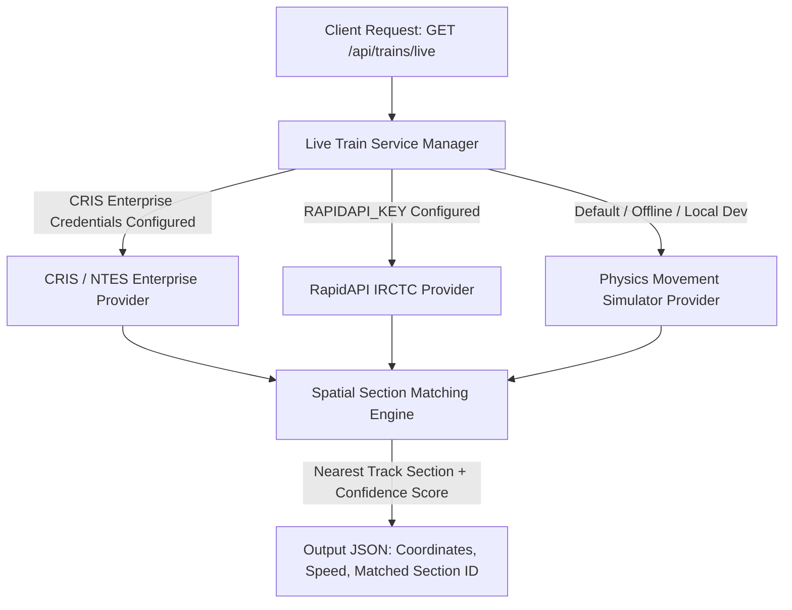

# Real-Time Train Tracking & Spatial Section Matching Architecture

## 1. Provider Pattern Architecture

Real-time train positioning uses a pluggable Provider Pattern (`LiveTrainProvider`). The system selects the appropriate provider based on deployment environment and credentials:

### Provider Matrix

| Provider | Implementation | Status | Configuration |
|---|---|---|---|
| **Mock Physics Simulator** | `backend/src/services/live-train/mockProvider.js` | Active by default | Zero config; simulates actual timetable trains moving along real OSM track LineStrings based on clock time. |
| **RapidAPI IRCTC Gateway** | `backend/src/services/live-train/rapidapiProvider.js` | Production Ready | `LIVE_TRAIN_API_KEY` or `RAPIDAPI_KEY` in `.env` |
| **CRIS / NTES Official Enterprise** | `backend/src/services/live-train/crisEnterpriseProvider.js` | Enterprise Template | `CRIS_ENDPOINT`, `CRIS_CLIENT_ID`, `CRIS_CLIENT_SECRET` |

---

## 2. Spatial Section Matching Engine

Implemented in `backend/src/services/section-matching.service.js`:

1. **Perpendicular Distance Calculation**:
   Given a GPS coordinate $(lat, lon)$, the engine computes the perpendicular distance in meters to each line segment $(s_1, s_2)$ of all railway track sections using the Haversine formula and projection scalar $t$:
   $$t = \max\left(0, \min\left(1, \frac{(lat - s_{1,lat})(s_{2,lat} - s_{1,lat}) + (lon - s_{1,lon})(s_{2,lon} - s_{1,lon})}{|s_2 - s_1|^2}\right)\right)$$

2. **Confidence Scoring**:
   Confidence is calculated inversely proportional to distance from the track centerline:
   $$\text{Confidence} = \max\left(10, \min\left(100, 100 - \left(\frac{\text{Distance (m)}}{\text{Max Tolerance (2000m)}}\right) \times 90\right)\right)$$
   - Point on track (0m): **100% confidence**
   - Point within standard GPS drift (50m): **98% confidence**
   - Point at 500m: **78% confidence**

---

## 3. Official Indian Railways Enterprise Gateway (CRIS/RTIS) Requirements

To transition from commercial API gateways to official Ministry of Railways feeds:

1. **Institutional Agreement**: An MoU with the Railway Board / CRIS (Centre for Railway Information Systems).
2. **Dedicated Whitelisted IP**: Static public IP registered in the CRIS firewall whitelist.
3. **Mutual TLS (mTLS)**: Exchange of x509 client and CA certificates.
4. **RTIS (Real-time Train Information System)**: Access to the ISRO-GPS loco-mounted transponder datastream transmitting coordinates every 30 seconds via satellite communications.

---

## 4. Frontend Integration

In `LiveMap.jsx`:
- Live trains stream every 6 seconds from `GET /api/trains/live`.
- Visualized as green (on-time) or orange (delayed) pulsating markers directly on the interactive Leaflet map.
- Clicking any track section filters live trains currently passing through that physical corridor.
