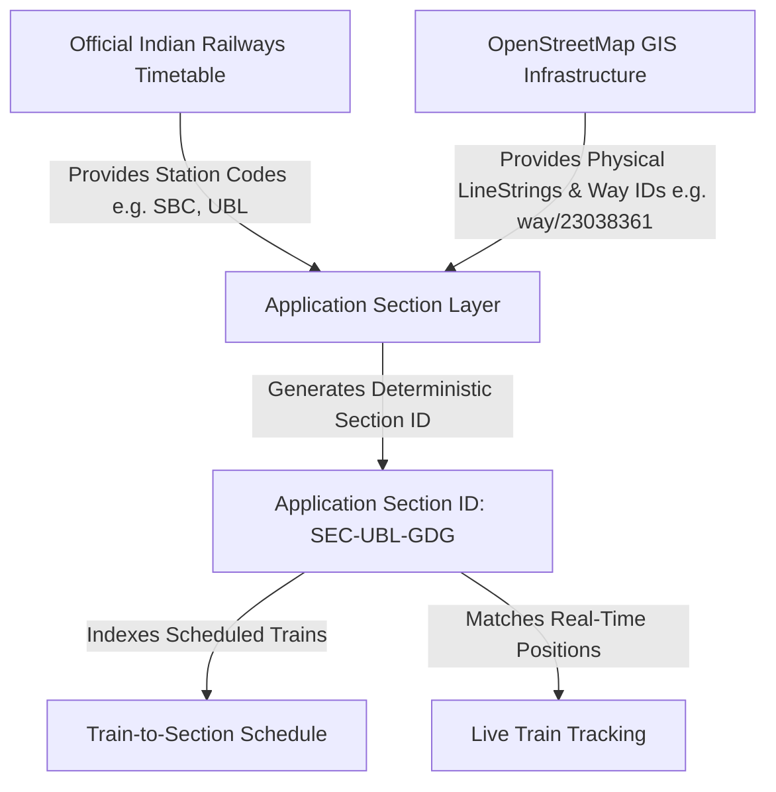

# Indian Railway Data Architecture & Integration Guide

## 1. Overview & Data Provenance

The Automatic Block Planning System (RBPS) integrates authentic, publicly available Indian Railway datasets and OpenStreetMap geospatial geometry to power real-time traffic analysis, corridor possession planning, conflict detection, and live tracking.

### Data Sources

| Domain | Dataset Source | Source Authority | Count / Coverage |
|---|---|---|---|
| **Stations** | Open Government Data (OGD) Platform India | Ministry of Railways, Govt of India | 8,990 Stations (All India) |
| **Official Trains** | National Timetable Schedule Master | Centre for Railway Information Systems (CRIS) / OGD India | 5,208 Trains (5-Digit Official) |
| **Timetable Schedules** | Official Train Route & Stop Sequences | Ministry of Railways / DataMeet Railways Project | 417,080 Stop Sequences |
| **Track Geometry** | OpenStreetMap (OSM) Railway Infrastructure | Overpass Turbo OSM Contributors | 5,461 Physical Track Ways (Karnataka & Corridors) |
| **Live Tracking** | Physics Movement Engine & CRIS/RapidAPI Gateway | RBPS Live Engine & Commercial Gateway | Dynamic Real-Time Position Stream |

---

## 2. Identifier Hierarchy & Provenance

To maintain operational integrity and avoid misattribution, the system strictly distinguishes between three layers of identifiers:

### Identifier Types

1. **Official Indian Railways Identifiers**:
   - **Station Code**: Official 3-4 character IR alphabetic code (`SBC` for KSR Bengaluru, `UBL` for SSS Hubballi, `MYS` for Mysuru Junction).
   - **Train Number**: Official 5-digit IR train number (`12627` Karnataka Express, `12007` Shatabdi Express, `16589` Rani Chennamma Express).
   - **Timetable Sequences**: Official stop sequences with arrival and departure timestamps.
   - *Note: Indian Railways does not publish public digital track segment identifiers for maintenance block booking.*

2. **OpenStreetMap (OSM) GIS Identifiers**:
   - **Way ID**: Authentic OpenStreetMap way identifiers (`way/23038361`, `way/23515903`).
   - **Physical Tags**: Gauge (`1676` mm broad gauge), electrification status (`contact_line` 25kV AC), operational max speed, track count (`passenger_lines: 2`).

3. **Application-Level Section IDs (`SEC-...`)**:
   - **Format**: `SEC-{FROM_STATION}-{TO_STATION}` (e.g., `SEC-BWT-BFW`, `SEC-UBL-HBQ`, `SEC-BNC-SBC`).
   - **Disambiguated Format**: `SEC-{FROM}-{TO}-{OSM_WAY_NUM}` if multiple physical tracks connect the same pair.
   - **Purpose**: Provides a deterministic, human-readable identifier for block possession requests, corridor possession scheduling, and maintenance window planning.
   - **Disclaimer**: *Explicitly flagged with `is_official_ir_track_id: false` and `official_ir_identifier: null` in all API responses to ensure absolute legal clarity.*

---

## 3. Database Schema

Defined in `backend/sql/011_real_railway_schema.sql`:

1. **`stations`**:
   - `station_code` (VARCHAR(20), PK/UNIQUE)
   - `station_name` (VARCHAR(255))
   - `latitude`, `longitude` (NUMERIC(10, 6))
   - `zone` (VARCHAR(50)), `division` (VARCHAR(50))
   - `source` ('OGD_INDIA')

2. **`official_trains`**:
   - `train_no` (VARCHAR(50), PK/UNIQUE)
   - `train_name` (VARCHAR(255))
   - `source_station`, `destination_station` (FK -> stations)
   - `train_type` ('SUPERFAST', 'EXPRESS', 'VANDE BHARAT', 'SHATABDI', 'GOODS')
   - `distance_km` (NUMERIC(8, 2))

3. **`train_stops`**:
   - `train_no` (VARCHAR(50))
   - `station_code` (VARCHAR(20))
   - `sequence` (INT)
   - `arrival_time`, `departure_time` (TIME)
   - `day` (INT)

4. **`track_sections`**:
   - `section_id` (VARCHAR(100), PK)
   - `from_station`, `to_station` (VARCHAR(20))
   - `distance_km` (NUMERIC(8, 2))
   - `geometry` (GEOMETRY(LineString, 4326))
   - `source` ('osm')
   - `source_id` (OSM way ID)
   - `railway_asset_id` (NULL - Reserved for official IR asset ID)

5. **`train_section_schedule`**:
   - `train_no` (VARCHAR(50))
   - `section_id` (VARCHAR(100), FK)
   - `scheduled_entry_time`, `scheduled_exit_time` (TIME)
   - `sequence` (INT)

---

## 4. REST API Reference

### Track & Section Endpoints

- `GET /api/tracks`: Returns full GeoJSON FeatureCollection of all 5,461 application railway sections.
- `GET /api/tracks/:trackId`: Returns a single section feature with stations, OSM way ID, distance, and tags.
- `GET /api/tracks/:trackId/trains`: Returns scheduled trains passing through this section.
- `GET /api/tracks/:trackId/schedule`: Compatible timetable schedule endpoint consumed by the Python Multi-Agent Service.
- `GET /api/tracks/:trackId/live`: Returns live moving trains currently situated on this physical track section.

### Station Endpoints

- `GET /api/stations?search=bangalore&limit=20`: Search 8,990 Indian railway stations by name, code, or state.
- `GET /api/stations/:code`: Returns station metadata and reverse-indexed passing trains.

### Train Endpoints

- `GET /api/trains?search=karnataka&limit=20`: Search 5,208 official Indian Railway trains.
- `GET /api/trains/:trainNo`: Official train details and total stop count.
- `GET /api/trains/:trainNo/route`: Stop-by-stop timetable route with arrival/departure times and station coordinates.
- `GET /api/trains/live`: Real-time positions for active trains across the network.
- `GET /api/trains/:trainNo/live`: Live tracking position and delay status for a specific train.
