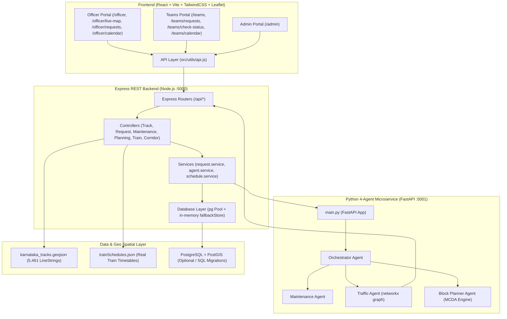
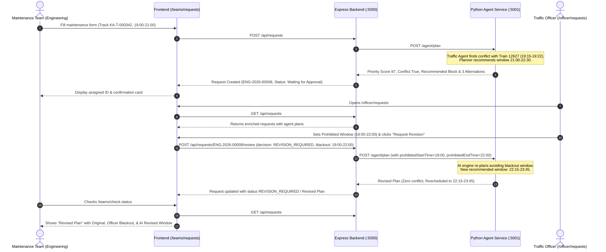
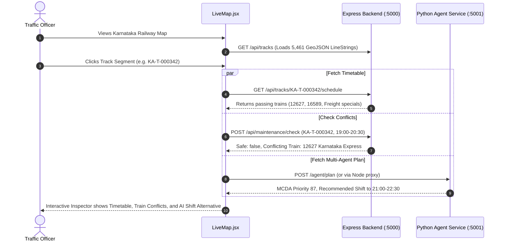

# Comprehensive System Walkthrough: Automatic Railway Block Planning System (RBPS)

An end-to-end guide to the **Automatic Railway Block Planning System (Karnataka State Geography)**, detailing every architectural layer, component file, data flow, user role, and AI optimization pipeline.

---

## 1. High-Level Architectural Flow

The system coordinates between three primary tiers plus persistent storage:



---

## 2. Complete File Inventory & Responsibilities

### 2.1 Backend Layer (`backend/`)

| File / Folder | Purpose & Architectural Role |
| :--- | :--- |
| [`server.js`](file:///c:/Users/navya%20sastry/.gemini/antigravity-ide/scratch/sih-pixel-singularity/backend/src/server.js) | Main entry point for the Node.js Express server (`PORT 5000`). Initializes DB, configures CORS, mounts `/api/*` routes, registers error handling middleware. |
| [`src/config/env.js`](file:///c:/Users/navya%20sastry/.gemini/antigravity-ide/scratch/sih-pixel-singularity/backend/src/config/env.js) | Centralized environment variable reader (`PORT`, `DATABASE_URL`, `AGENT_SERVICE_URL`, `JWT_SECRET`). |
| [`src/config/database.js`](file:///c:/Users/navya%20sastry/.gemini/antigravity-ide/scratch/sih-pixel-singularity/backend/src/config/database.js) | PostgreSQL connection pool and in-memory `fallbackStore` (preloaded with mock users, maintenance tasks, and requests). |
| [`src/routes/auth.routes.js`](file:///c:/Users/navya%20sastry/.gemini/antigravity-ide/scratch/sih-pixel-singularity/backend/src/routes/auth.routes.js) | Handles `POST /api/auth/login` and `GET /api/auth/me`. |
| [`src/routes/tracks.routes.js`](file:///c:/Users/navya%20sastry/.gemini/antigravity-ide/scratch/sih-pixel-singularity/backend/src/routes/tracks.routes.js) | Provides GeoJSON tracks (`GET /api/tracks`), track details, real-time schedule (`GET /api/tracks/:id/schedule`), and traffic (`GET /api/tracks/:id/traffic`). |
| [`src/routes/requests.routes.js`](file:///c:/Users/navya%20sastry/.gemini/antigravity-ide/scratch/sih-pixel-singularity/backend/src/routes/requests.routes.js) | Manages maintenance requests (`POST /api/requests`, `GET /api/requests`, `GET /api/requests/:id`, `POST /api/requests/:id/review`). |
| [`src/routes/maintenance.routes.js`](file:///c:/Users/navya%20sastry/.gemini/antigravity-ide/scratch/sih-pixel-singularity/backend/src/routes/maintenance.routes.js) | Maintenance task inventory (`GET /api/maintenance`) and conflict check endpoint (`POST /api/maintenance/check`). |
| [`src/routes/trains.routes.js`](file:///c:/Users/navya%20sastry/.gemini/antigravity-ide/scratch/sih-pixel-singularity/backend/src/routes/trains.routes.js) | Train schedules and route segments (`GET /api/trains`, `GET /api/trains/:trainNo/route`). |
| [`src/routes/corridors.routes.js`](file:///c:/Users/navya%20sastry/.gemini/antigravity-ide/scratch/sih-pixel-singularity/backend/src/routes/corridors.routes.js) | Corridor catalog and availability slots (`GET /api/corridors`, `GET /api/corridors/:id`). |
| [`src/routes/planning.routes.js`](file:///c:/Users/navya%20sastry/.gemini/antigravity-ide/scratch/sih-pixel-singularity/backend/src/routes/planning.routes.js) | Block planning endpoints (`POST /api/planning/agent-plan`, `POST /api/planning/weekly`, `POST /api/planning/monthly`). |
| [`src/controllers/track.controller.js`](file:///c:/Users/navya%20sastry/.gemini/antigravity-ide/scratch/sih-pixel-singularity/backend/src/controllers/track.controller.js) | Loads 5,461 OSM track geometries from `karnataka_tracks.geojson`, dynamically generates train timetables across 7 days for any track segment, handles spatial searches. |
| [`src/controllers/request.controller.js`](file:///c:/Users/navya%20sastry/.gemini/antigravity-ide/scratch/sih-pixel-singularity/backend/src/controllers/request.controller.js) | Request ingestion, enrichment, and Officer review handling. |
| [`src/controllers/maintenance.controller.js`](file:///c:/Users/navya%20sastry/.gemini/antigravity-ide/scratch/sih-pixel-singularity/backend/src/controllers/maintenance.controller.js) | Conflict check logic (`train.arrival < maint.end AND train.departure > maint.start`). |
| [`src/services/request.service.js`](file:///c:/Users/navya%20sastry/.gemini/antigravity-ide/scratch/sih-pixel-singularity/backend/src/services/request.service.js) | Request lifecycle state machine, invoking the Multi-Agent engine upon creation and review with blackout rescheduling. |
| [`src/services/agent.service.js`](file:///c:/Users/navya%20sastry/.gemini/antigravity-ide/scratch/sih-pixel-singularity/backend/src/services/agent.service.js) | HTTP bridge to Python Agent microservice on port 5001 with embedded JavaScript fallback orchestrator if Python is offline. |
| [`src/services/schedule.service.js`](file:///c:/Users/navya%20sastry/.gemini/antigravity-ide/scratch/sih-pixel-singularity/backend/src/services/schedule.service.js) | Generates train timetable slots for any track in Karnataka using realistic passenger and freight patterns. |
| [`sql/*.sql`](file:///c:/Users/navya%20sastry/.gemini/antigravity-ide/scratch/sih-pixel-singularity/backend/sql/) | 9 schema migrations (`001_users.sql` through `009_audit.sql`) establishing PostGIS tables, spatial indices, constraints, and audit logging. |
| [`data/karnataka_tracks.geojson`](file:///c:/Users/navya%20sastry/.gemini/antigravity-ide/scratch/sih-pixel-singularity/backend/data/karnataka_tracks.geojson) | 5,461 actual OSM railway track segments for Karnataka with coordinates, lengths, and railway tags. |
| [`data/trainSchedules.json`](file:///c:/Users/navya%20sastry/.gemini/antigravity-ide/scratch/sih-pixel-singularity/backend/data/trainSchedules.json) | Curated schedule dataset for Karnataka passenger express trains (e.g., Karnataka Express, Rani Chennamma Express). |

---

### 2.2 Python Multi-Agent Optimization Service (`backend/agent-service/`)

| File | Responsibilities |
| :--- | :--- |
| [`main.py`](file:///c:/Users/navya%20sastry/.gemini/antigravity-ide/scratch/sih-pixel-singularity/backend/agent-service/main.py) | FastAPI service on port 5001 exposing `/health` and `/agent/plan`. |
| [`orchestrator/orchestrator_agent.py`](file:///c:/Users/navya%20sastry/.gemini/antigravity-ide/scratch/sih-pixel-singularity/backend/agent-service/orchestrator/orchestrator_agent.py) | Sequences the pipeline: Maintenance Agent $\to$ Traffic Agent $\to$ Block Planner Agent, aggregating responses. |
| [`maintenance/maintenance_agent.py`](file:///c:/Users/navya%20sastry/.gemini/antigravity-ide/scratch/sih-pixel-singularity/backend/agent-service/maintenance/maintenance_agent.py) | Ingests raw requests/tasks, computes normalized scores (criticality, urgency, failure probability, overdue days, safety score). |
| [`traffic/traffic_agent.py`](file:///c:/Users/navya%20sastry/.gemini/antigravity-ide/scratch/sih-pixel-singularity/backend/agent-service/traffic/traffic_agent.py) | Connects to Node API to query real train timetables for the specified track, checks time window overlaps, builds a `networkx` track topology graph to compute bypass rerouting. |
| [`block_planner/block_planner_agent.py`](file:///c:/Users/navya%20sastry/.gemini/antigravity-ide/scratch/sih-pixel-singularity/backend/agent-service/block_planner/block_planner_agent.py) | Computes 7-factor Multi-Criteria Decision Analysis (MCDA) score, evaluates conflicts, and generates ranked alternatives (`RESCHEDULE`, `REROUTE`, `DELAY`, `DIRECT CLEARANCE`). |

---

### 2.3 Frontend Layer (`frontend/`)

| File / Folder | Purpose & Architectural Role |
| :--- | :--- |
| [`src/App.jsx`](file:///c:/Users/navya%20sastry/.gemini/antigravity-ide/scratch/sih-pixel-singularity/frontend/src/App.jsx) | Root application component wrapping providers (`AuthProvider`, `ThemeProvider`, `BrowserRouter`). |
| [`src/routes/AppRoutes.jsx`](file:///c:/Users/navya%20sastry/.gemini/antigravity-ide/scratch/sih-pixel-singularity/frontend/src/routes/AppRoutes.jsx) | Defines all application routes guarded by `ProtectedRoute`: `/login`, `/admin`, `/officer/*`, and `/teams/*`. |
| [`src/routes/ProtectedRoute.jsx`](file:///c:/Users/navya%20sastry/.gemini/antigravity-ide/scratch/sih-pixel-singularity/frontend/src/routes/ProtectedRoute.jsx) | Role-based authentication guard verifying `user.role` matches `allowedRole`. |
| [`src/utils/api.js`](file:///c:/Users/navya%20sastry/.gemini/antigravity-ide/scratch/sih-pixel-singularity/frontend/src/utils/api.js) | Centralized client communicating with Express backend (`http://localhost:5000/api`) and Python Agent (`http://localhost:5001`), with graceful mock fallback. |
| [`src/pages/LoginPage.jsx`](file:///c:/Users/navya%20sastry/.gemini/antigravity-ide/scratch/sih-pixel-singularity/frontend/src/pages/LoginPage.jsx) | Login screen with pre-populated credentials for Admin, Traffic Officer, and Maintenance Teams. |
| [`src/pages/admin/AdminDashboard.jsx`](file:///c:/Users/navya%20sastry/.gemini/antigravity-ide/scratch/sih-pixel-singularity/frontend/src/pages/admin/AdminDashboard.jsx) | User management table, role filtering (Admin, Officer, Teams), department assignment, user creation modal. |
| [`src/pages/officer/OfficerDashboard.jsx`](file:///c:/Users/navya%20sastry/.gemini/antigravity-ide/scratch/sih-pixel-singularity/frontend/src/pages/officer/OfficerDashboard.jsx) | High-level metrics: Total Requests, Pending Review, Approved, Active Blocks, and upcoming maintenance table. |
| [`src/pages/officer/OfficerRequests.jsx`](file:///c:/Users/navya%20sastry/.gemini/antigravity-ide/scratch/sih-pixel-singularity/frontend/src/pages/officer/OfficerRequests.jsx) | Interactive review inbox for Traffic Officers. Displays MCDA scores, conflicting trains, recommended block window, and actions to Approve, Reject, or Set Prohibited Blackout Window. |
| [`src/pages/officer/LiveMap.jsx`](file:///c:/Users/navya%20sastry/.gemini/antigravity-ide/scratch/sih-pixel-singularity/frontend/src/pages/officer/LiveMap.jsx) | Leaflet GIS map rendering all 5,461 OSM track segments. Clicking a track inspects live train timetables, runs conflict checks, and invokes the Multi-Agent Planner. |
| [`src/pages/officer/OfficerCalendar.jsx`](file:///c:/Users/navya%20sastry/.gemini/antigravity-ide/scratch/sih-pixel-singularity/frontend/src/pages/officer/OfficerCalendar.jsx) | Monthly/Weekly calendar view of approved blocks with conflict indicators. |
| [`src/pages/teams/TeamsDashboard.jsx`](file:///c:/Users/navya%20sastry/.gemini/antigravity-ide/scratch/sih-pixel-singularity/frontend/src/pages/teams/TeamsDashboard.jsx) | Team portal dashboard showing department-specific block statistics. |
| [`src/pages/teams/TeamRequests.jsx`](file:///c:/Users/navya%20sastry/.gemini/antigravity-ide/scratch/sih-pixel-singularity/frontend/src/pages/teams/TeamRequests.jsx) | Multi-step request submission form. Generates Request ID (e.g., `ENG-2026-00008`) and offers direct copy and tracking links. |
| [`src/pages/teams/CheckStatus.jsx`](file:///c:/Users/navya%20sastry/.gemini/antigravity-ide/scratch/sih-pixel-singularity/frontend/src/pages/teams/CheckStatus.jsx) | Real-time status tracker for maintenance teams. Expanding a row reveals the Officer's reason, blackout window, and the AI-generated revised block plan. |
| [`src/pages/teams/TeamCalendar.jsx`](file:///c:/Users/navya%20sastry/.gemini/antigravity-ide/scratch/sih-pixel-singularity/frontend/src/pages/teams/TeamCalendar.jsx) | Calendar visualization for team-specific scheduled blocks. |

---

## 3. End-to-End User Journeys & Data Flows

### Flow A: Maintenance Request Lifecycle & Officer Blackout Rescheduling



---

### Flow B: Live GIS Track Inspection & Real-Time Conflict Detection



---

## 4. Multi-Agent Optimization Engine Details

### MCDA (Multi-Criteria Decision Analysis) Scoring Formula
The Block Planner evaluates incoming tasks using the PRD-defined 7-factor weighted formula:

$$\text{Priority Score} = \sum (W_i \times S_i)$$

| Metric ($S_i$) | Weight ($W_i$) | Calculation Source |
| :--- | :---: | :--- |
| **Safety Criticality** | $20\%$ | Derived from overdue days ($>7$ days $\to 95$) or failure probability ($>60\% \to 95$). |
| **Asset Criticality** | $20\%$ | Track structure, speed rating, and traffic density rating ($0-100$). |
| **Urgency** | $15\%$ | Days until required maintenance interval expires. |
| **Overdue Score** | $15\%$ | $\min(\text{Overdue Days} \times 5, 100)$. |
| **Failure Probability** | $10\%$ | Dynamic sensor/asset degradation score ($0-100$). |
| **Asset Availability** | $10\%$ | Availability of machinery (tamper, crane, tower car). |
| **Train Impact** | $10\%$ | $95$ if clear window; drops to $40$ if passenger train conflict occurs. |

### Generated Alternatives Architecture
Whenever a conflict or prohibited window occurs, the Planner outputs three ranked alternatives:
1. **`RESCHEDULE` (Rank 1)**: Shifts the maintenance window to the nearest conflict-free gap. Zero passenger train delay, $0.00$ operational delay cost.
2. **`DELAY` (Rank 2)**: Regulates trailing goods/freight trains at preceding loop sidings (e.g., $15-20$ minutes).
3. **`REROUTE` (Rank 3)**: Dispatches non-stop freight traffic via chord junction bypasses using `networkx` topology graph calculation ($+14$ km to $+22$ km detour).

---

## 5. How to Run & Verify

### Start the Services Locally:
```bash
# 1. Express REST API (port 5000)
cd backend
npm run dev

# 2. Python 4-Agent Service (port 5001)
cd backend/agent-service
python main.py

# 3. React Frontend (port 5173)
cd frontend
npm run dev
```

### Run Full-Stack via Docker Compose (Recommended):
```bash
# Build and start all 3 containers (Frontend, Backend, Agent Service)
docker compose up --build -d

# Verify running services
docker compose ps

# Access frontend at http://localhost
```

### Run Automated Backend Tests:
```bash
cd backend
npm test
```

---

## 6. Deployment Guide Summary
Complete deployment instructions for **Docker Compose**, **Vercel**, **Render**, and **Supabase** are documented in [`DEPLOYMENT.md`](file:///c:/Users/navya%20sastry/.gemini/antigravity-ide/scratch/sih-pixel-singularity/DEPLOYMENT.md).

